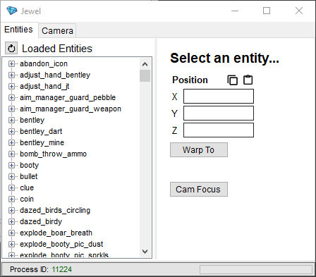

# Jewel
A PCSX2 trainer for Sly 2: Band of Thieves.



## Build Instructions
Clone the repo into Visual Studio and make sure the build target is set as x64.
  
If you get an error about Memory.dll, run this command from the Package Manager Console:
```
Update-Package -reinstall
```

If that still doesn't work, please open a [new issue](https://github.com/TheOnlyZac/Jewel/issues/new).